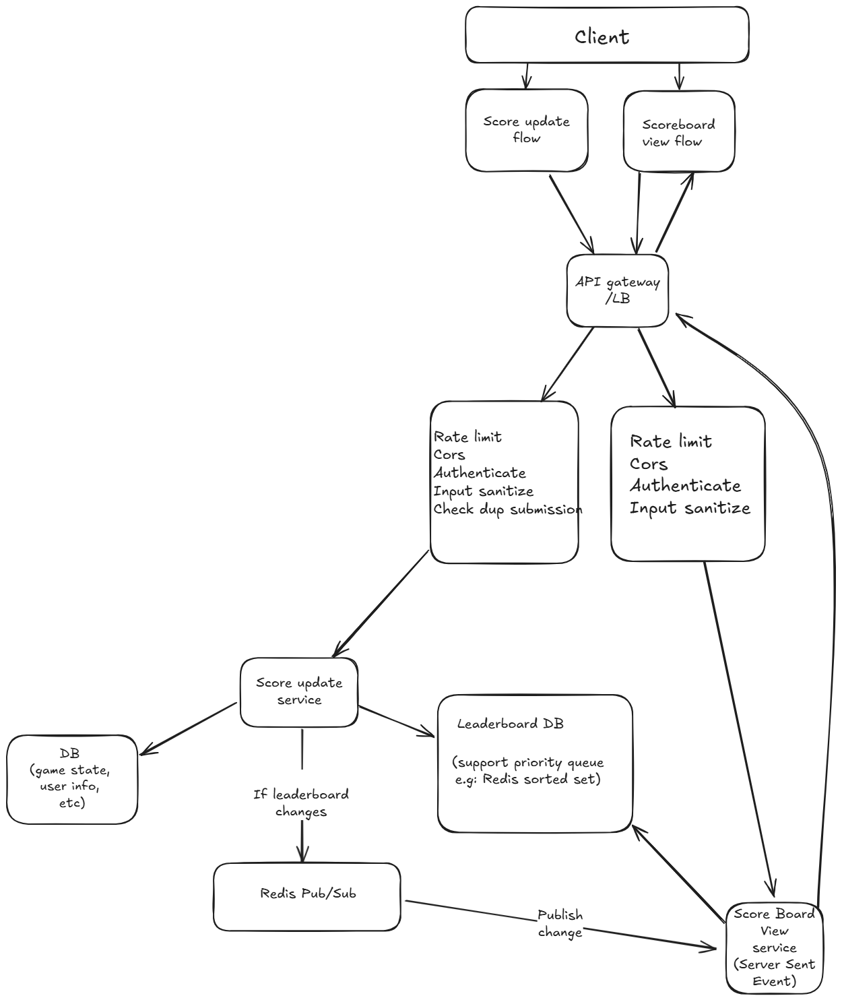

# Live Scoreboard System - Backend Specification

## Overview
This document outlines the specification for a real-time scoreboard system backend module. The system will track user scores, update them securely, and maintain a live leaderboard showing the top 10 users.

## Table of Contents
1. [Architecture & Flow Diagram & Data Flow](#architecture)
2. [API Endpoints](#api-endpoints)
3. [Authentication & Security](#authentication--security)
4. [Data Models](#data-models)
5. [Real-time Updates](#real-time-updates)
6. [Error Handling](#error-handling)
7. [Testing & Performance](#testing--performance)
8. [Deployment Considerations](#deployment-considerations)

## Architecture

The system consists of the following components:

- **API Gateway/Load Balancer**: Entry point for all requests
- **Score Update Service**: Validates and processes score updates
- **Scoreboard View Service**: Delivers real-time leaderboard data
- **Databases**:
  - Game State DB: Stores comprehensive user data and game state
  - Leaderboard DB: Optimized for fast leaderboard queries (Redis sorted set)
- **Real-time Communication**: Redis Pub/Sub system with Server-Sent Events (SSE)

---

## Flow Diagram



*The diagram shows the flow of score updates and leaderboard view requests through the system.*


## Data Flow

1. **Score Update Flow**
    - User performs an action → client sends score update to backend.
    - Apply rate limit, cors, validate input, authenticates request and check duplicated submission/action.
    - Score Update Service updates DB and Leaderboard (Redis sorted set).
    - If leaderboard changes, a message is published via Redis Pub/Sub.
    - Scoreboard view service receives update and pushes to connected clients via SSE.

2. **Scoreboard View Flow**
    - Client opens connection to SSE endpoint.
    - Apply rate limit, cors, validate input, authenticates request
    - Scoreboard view service streams top-10 updates as they arrive.


## API Endpoints

### Score Update Endpoint
```
POST /api/v1/scores/update
```

**Request Headers**:
- `Authorization`: Bearer token for user authentication
- `Content-Type`: application/json

**Request Body**:
```json
{
  "actionId": "string",  // Unique identifier of the completed action, avoid duplicated requests
  "data": {}         // Context data about the action
}
```

**Response**:
```json
{
  "success": true,
  "newScore": 1250,
  "rank": 4,
  "leaderboardChanged": true
}
```

### Scoreboard View Endpoint
```
GET /api/v1/scores/leaderboard
```

**Request Headers**:
- `Authorization`: Bearer token

**Response**:
```json
{
  "leaderboard": [
    {
      "userId": "user123",
      "username": "PlayerOne",
      "score": 5000,
      "rank": 1
    },
    // ... up to 10 entries
  ]
}
```

### Real-time Scoreboard Stream
```
GET /api/v1/scores/leaderboard/live
```
Establishes SSE connection for real-time updates.

## Authentication & Security

1. **JWT Authentication**:
   - All score update requests must include valid JWT
   - Tokens should be short-lived (max 1 hour)
   - Include user ID and permissions in payload

2. **Rate Limiting**:
   - Score updates: X requests per minute per user
   - Leaderboard views: Y requests per minute per user/IP

3. **Action Verification**:
   - Each score update must reference a valid actionId
   - Server validates actionId hasn't been used before (prevents replay attacks)
   - Server validates action is allowed for the user

4. **Input Validation**:
   - All input must be sanitized and validated
   - Schema validation for all request bodies

## Data Models
Here we use NoSQL DB because we don't have complex data relationship, and, read requests >>> write requests
### User
```javascript
{
  id: String,          // Unique identifier
  username: String,    // Display name
  score: Number,       // Current total score
  lastUpdated: Date,   // Timestamp of last score change
  actionsPerformed: [  // Log of actions that affected score
    {
      actionId: String,
      timestamp: Date,
      scoreChange: Number
    }
  ]
}
```

### Leaderboard Entry
```javascript
{
  userId: String,     // Reference to user
  username: String,   // Cached username for display
  score: Number,      // Current score
  rank: Number        // Current position
}
```

## Real-time Updates

1. **Update Process**:
   - When a score update affects the top 10 leaderboard
   - Publish change event to Redis channel
   - Scoreboard View service consumes events
   - Events are pushed to clients via SSE

2. **Event Format**:
```javascript
{
  type: "LEADERBOARD_UPDATE",
  data: {
    leaderboard: [/* top 10 users */],
    updatedAt: timestamp
  }
}
```

## Error Handling

All API endpoints should return appropriate HTTP status codes:
- `200 OK`: Successful operation
- `400 Bad Request`: Invalid input
- `401 Unauthorized`: Missing/invalid authentication
- `403 Forbidden`: Valid authentication but insufficient permissions
- `429 Too Many Requests`: Rate limit exceeded
- `500 Internal Server Error`: Server-side failure

Error responses should follow consistent format:
```json
{
  "error": true,
  "code": "400",
  "message": "Invalid input",
  "details": {} // Optional additional info
}
```

## Testing & Performance

1. **Load Testing**:
   - System should support at least 10K(?) concurrent users
   - Score updates should be processed within < 300ms
   - Leaderboard's new update should return < 300ms

2. **Security Testing**:
   - Rate limit effectiveness validation
   - Authentication bypass attempts

## Deployment Considerations

1. **Scalability**:
   - Horizontally scale API servers
   - Consider AWS managed services for high available solution

2. **Monitoring**:
   - Track API latency and error rates
   - Monitor infrastructure usage
   - Alert on unusual score update patterns (potential cheating)


---

## Improvement Suggestions

1. **Anti-Cheat Mechanisms**:
   - Implement server-side verification of action legitimacy
   - Track and flag unusual patterns of score increases
   - Consider time-based limits on score gains

2. **Leaderboard Caching**:
   - Maintain a memory cache of top-10 users, only recompute when scores change significantly, to reduce Redis load.

3. **Performance Optimization**:
   - Consider batch processing for high-frequency score updates
   - Implement background job for recalculating ranks periodically